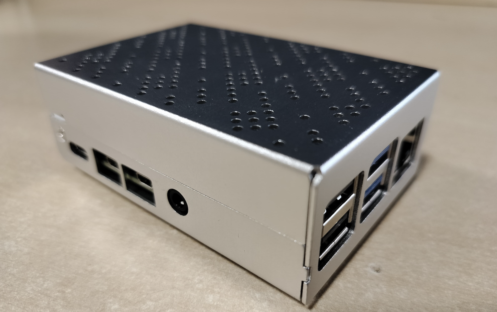
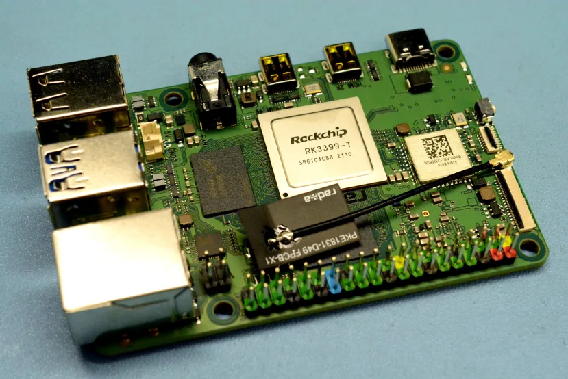
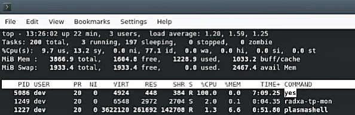
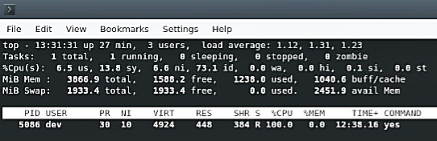

# Aegis-Ops

 
 


A suite of **POSIX-compliant** administrative tools and kernel-level resource investigations designed for ARM-based SBC architectures. Aegis-Ops provides a centralised interface for system telemetry, automated security auditing, and manual scheduler intervention.

---

## Development Environment
The suite was developed and validated on bare-metal hardware to ensure compatibility with ARM Cortex-A53 performance constraints.

### **Validation Platform**

| Validated Hardened Chassis | Core Component Architecture |
| :---: | :---: |
|  |  |
| *ROCK-based Debian system deployed in rugged environment.* | *Detailed inspection of the ARM processor and physical interfaces.* |

---

## System Architecture & Logic
The primary engine, `toolkit.sh`, is built for high availability and terminal robustness. It utilises a continuous execution model with built-in error trapping to prevent script termination during privileged execution.

### **Architectural Control Flow**
<p align="center">
  
</p>

* **Robust Loop:** Infinite `while true` loop encasing a strict switch-case module routing.
* **Exception Handling:** Wildcard catch-all for invalid inputs to maintain UI stability.
* **Stream Management:** Redirection of standard error (`2>/dev/null`) to keep logs clean during permission-heavy tasks.

---

## Core Administration Modules
The toolkit aggregates ten critical system utilities into a single high-performance interface.

| Module | Functionality | OS Concept |
| :--- | :--- | :--- |
| **Telemetry** | Live kernel parsing via `uname`, `lscpu`, and `free -h`. | System Information |
| **Storage** | Automated find-and-sort for directory overhead analysis. | File System Management |
| **Security** | Regex-based password entropy auditing and `openssl` generation. | Cryptography & Auditing |
| **Recovery** | Timestamped `.tar.gz` archiving with automated permission logs. | Data Redundancy |
| **Logging** | Regex-filtered `syslog` analysis for proactive error flagging. | System Diagnostics |

---

## Kernel Investigation: CFS Scheduling
Aegis-Ops includes a specialised module (`cfs-override.sh`) to observe and manipulate the **Linux Completely Fair Scheduler (CFS)** behavior.

### **The Methodology**
1.  **Synthetic Load:** A workload is initialised to saturate a CPU core at a default **Nice (NI) value of 0**.
2.  **Intervention:** Using the `renice` utility, a **+10 NI offset** is injected into the running process.
3.  **Outcome:** The kernel translates the user-space "Nice" value into a **Priority (PR)** integer, forcing the process to yield CPU cycles to critical system daemons.

### **Empirical Proof: CFS Intervention**

| Phase 1: Baseline Load (NI: 0) | Phase 2: Post-Intervention (NI: +10) |
| :---: | :---: |
|  |  |
| *Process initialised at default priority.* | *Kernel-level priority shift verified via top.* |

> **Note:** Final cleanup was performed via `killall yes` to restore system stability.

---

## Documentation
For a deep dive into the implementation defense, POSIX compliance standards, and detailed hardware constraints, see the full documentation:

**[Architecture Overview PDF](./docs/Linux.pdf)**

---

## Installation & Usage

1. **Clone the repository:**
   ```bash
   git clone https://github.com/SriVigneswaran7/Aegis-Ops.git
   cd Aegis-Ops
   ```

2. **Grant execution permissions:**
   ```bash
   chmod +x scripts/*.sh
   ```

3. **Launch the suite:**
   ```bash
   ./scripts/toolkit.sh
   ```
---
*Developed by Sri Vigneswaran under the [MIT License](./LICENSE)*
